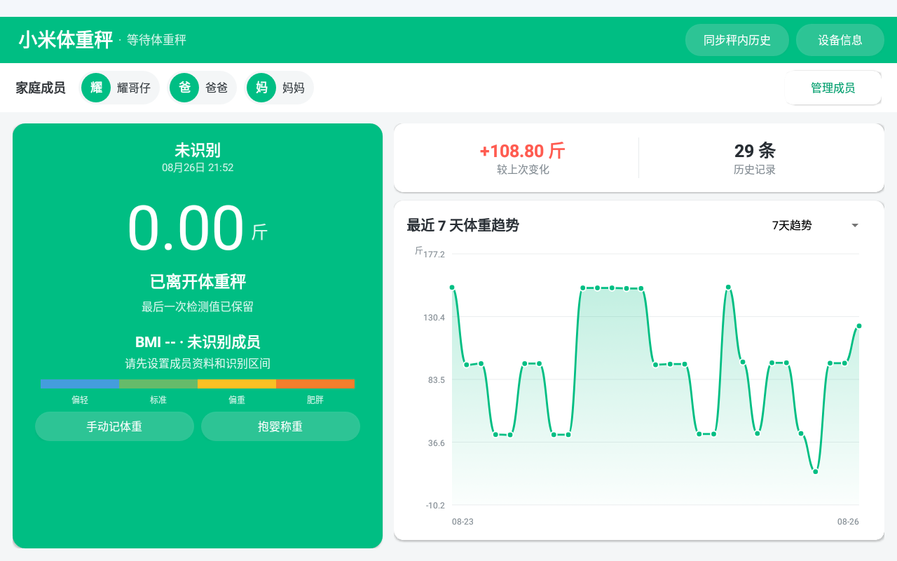
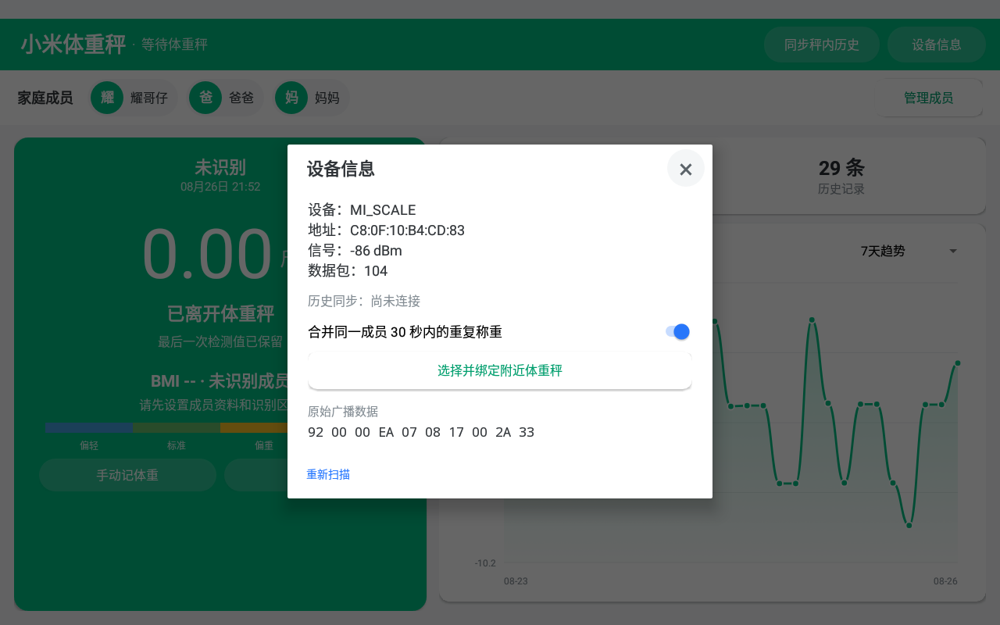

# CC10 小米体重秤

为天猫精灵 CC10（TG_Z04、Android 8.1、ARMv7、1280×800）设计的小米体重秤 XMTZC01HM 客户端。应用使用 Android 原生 View 与 Canvas 绘制，通过 BLE 广播读取体重，并在需要时通过 GATT 校准体重秤时间。

当前版本：`5.9`

## 界面预览

### 主界面



### 设备信息



## 主要功能

- 扫描并解析 XMTZC01HM BLE 广播。
- 根据协议显示 kg、斤或磅等实际单位。
- 显示实时重量、稳定状态和离秤状态。
- 设备时间比 CC10 慢一小时以上时执行时间校准。
- 多家庭成员及体重区间自动识别。
- 无成员范围匹配时在首页显示“未识别”。
- 7天、30天和全部体重趋势，按称重记录均等间隔绘制。
- BMI、目标体重和体重状态色带。
- 历史记录补录、行内修改及左滑删除。
- 30秒内重复称重记录合并。
- 附近多台体重秤选择与绑定。
- 抱婴称重。
- 本地 SQLite 数据保存，不依赖云端账号。

## 直接安装

已编译并完成 CC10 实机验证的 APK：

[`release/CC10-Xiaomi-Scale-v5.9.apk`](release/CC10-Xiaomi-Scale-v5.9.apk)

```powershell
adb install -r release/CC10-Xiaomi-Scale-v5.9.apk
```

SHA-256：

```text
5af7e52201fd580a2591213602aadf767ebffd7daa3e51015f9f742b6d1a10c6
```

首次启动需允许位置权限并打开蓝牙。Android 8.1 扫描 BLE 设备需要位置权限，但应用不会上传位置或体重数据。

## 构建

准备：

- JDK 8 或兼容 JDK
- Android SDK Platform 27
- Android Build Tools（包含 `aapt`、`d8`、`zipalign`）
- `uber-apk-signer.jar`

设置环境变量：

```powershell
$env:ANDROID_SDK_ROOT = "C:\Android\Sdk"
$env:JAVA_HOME = "C:\Program Files\Java\jdk-17"
$env:UBER_APK_SIGNER_JAR = "C:\tools\uber-apk-signer.jar"
```

执行：

```powershell
.\Build-XiaomiScale.ps1
```

输出文件位于 `build/out/`。

## 数据与隐私

- 成员资料和体重记录仅保存在设备本地数据库中。
- 仓库不包含任何实机数据库、成员资料、蓝牙地址或历史体重数据。
- 升级安装会保留已有成员和历史记录；卸载应用通常会清除本地数据，请先自行备份。

## 适用范围

当前协议实现主要针对小米体重秤一代 `XMTZC01HM`。该型号不提供体脂、阻抗、心率或肌肉量数据，因此应用不会伪造这些指标。
